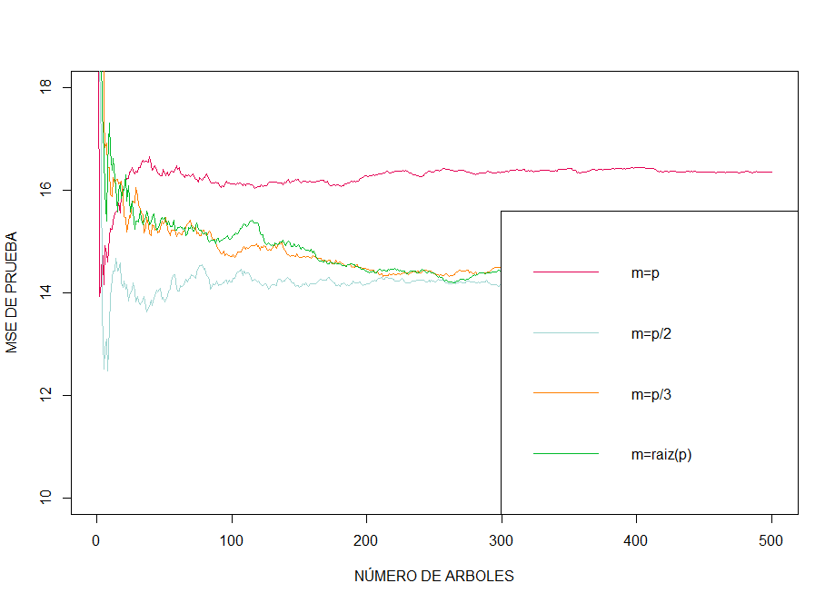

<html>
<head>

</head>
<body>

<h2 style="text-align:justify">Apartado 4.7 ejercicios de clasificación </h2>

<h3 style="text-align:justify">Ejercicio 10: conjunto de datos Weekly </h3>

<a class="example_f" href="Punto10.html" target="_blank" rel="nofollow">Pulse aqui para ver el analisis del ejercicio 10</a>

<h3 style="text-align:justify">Ejercicio 11: conjunto de datos auto </h3>

<a class="example_f" href="Punto11.html" target="_blank" rel="nofollow">Pulse aqui para ver el analisis del ejercicio 11</a>

<h3 style="text-align:justify">Ejercicio 12: Realizar funciones </h3>

<a class="example_f" href="Apartado-4.7.2-Ejercicio-12.html" target="_blank" rel="nofollow">Pulse aqui para visualizar el  ejercicio 12</a>

<h3 style="text-align:justify">Ejercicio 13: conjunto de datos Boston  </h3>

<a class="example_f" href="Apartado-4.7.2-Ejercicio-13.html" target="_blank" rel="nofollow">Pulse aqui para ver el analisis del ejercicio 13</a>

<h2 style="text-align:justify">Apartado 8.4 ejercicios de árboles de regresión </h2>

<h3 style="text-align:justify">Ejercicio 7: conjunto de datos Boston </h3>

<a class="example_f" href="Apartado-8.4-Ejercicio-7.html" target="_blank" rel="nofollow">Pulse aqui para ver el analisis del ejercicio 7</a>

<h3 style="text-align:justify">Ejercicio 8:conjunto de datos Carseats </h3>

<a class="example_f" href="Apartado-8.4-Ejercicio-8.html" target="_blank" rel="nofollow">Pulse aqui para ver el analisis del ejercicio 8</a>

<h3 style="text-align:justify">Ejercicio 9: Conjunto de datos OJ </h3>

<a class="example_f" href="Apartado-8.4-Ejercicio-9.html" target="_blank" rel="nofollow">Pulse aqui para ver el analisis del ejercicio 9</a>

<h3 style="text-align:justify">Ejercicio 10: Conjunto de datos Hitters</h3>

<a class="example_f" href="Apartado-8.4-Ejercicio-10.html" target="_blank" rel="nofollow">Pulse aqui para ver el analisis del ejercicio 10</a>

<h3 style="text-align:justify">Ejercicio 11: Conjunto de datos Caravan </h3>

<a class="example_f" href="Apartado-8.4-Ejercicio-11.html" target="_blank" rel="nofollow">Pulse aqui para ver el analisis del ejercicio 11</a>

<h3 style="text-align:justify">Ejercicio 12: Conjunto de datos aleatorios </h3>

<a class="example_f" href="Apartado-8.4-Ejercicio-7.html" target="_blank" rel="nofollow">Pulse aqui para ver el analisis del ejercicio 12</a>

<h2 style="text-align:justify">Apartado 9.7.2 ejercicios de maquinas de soporte vectorial </h2>

<h3 style="text-align:justify">Ejercicio 4:  </h3>

<a class="example_f" href="Apartado-9.7-Ejercicio-4.html" target="_blank" rel="nofollow">Pulse aqui para ver el analisis del ejercicio 4</a>

<h3 style="text-align:justify">Ejercicio 5:  </h3>

<a class="example_f" href="Apartado-9.7-Ejercicio-5.html" target="_blank" rel="nofollow">Pulse aqui para ver el analisis del ejercicio 5</a>

<h3 style="text-align:justify">Ejercicio 6:  </h3>

<a class="example_f" href="Apartado-9.7-Ejercicio-6.html" target="_blank" rel="nofollow">Pulse aqui para ver el analisis del ejercicio 6</a>

<h3 style="text-align:justify">Ejercicio 7:  </h3>

<a class="example_f" href="Apartado-9.7-Ejercicio-7.html" target="_blank" rel="nofollow">Pulse aqui para ver el analisis del ejercicio 7</a>

<h3 style="text-align:justify">Ejercicio 8:  </h3>

<a class="example_f" href="Apartado-9.7-Ejercicio-8.html" target="_blank" rel="nofollow">Pulse aqui para ver el analisis del ejercicio 8</a>

</body>
</html>

<html>
<head>

</head>
<body>

</body>
</html>
